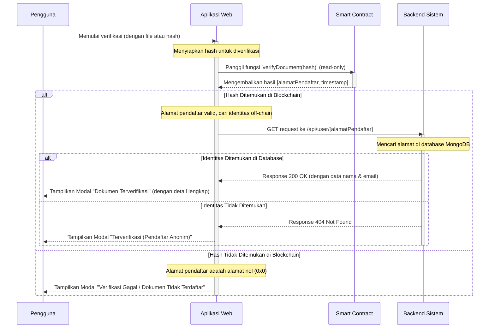

# Analisis Diagram Mermaid Sequence - Sistem Verifikasi Dokumen

## Objective
Menganalisis kesesuaian diagram Mermaid sequence dengan implementasi aktual sistem verifikasi dokumen berbasis blockchain yang telah dibangun.

## Diagram Mermaid yang Dianalisis

## Analisis Kesesuaian dengan Implementasi Sistem

### ✅ Aspek yang Sesuai dengan Implementasi

1. **Partisipan/Komponen Sistem**
   - User (Pengguna): Sesuai dengan interface pengguna di verify.js
   - Frontend (Aplikasi Web): Sesuai dengan Next.js React application
   - Blockchain (Smart Contract): Sesuai dengan DocumentRegistry.sol
   - Backend (Backend Sistem): Sesuai dengan Next.js API routes

2. **Alur Verifikasi Blockchain**
   - Pemanggilan fungsi verifyDocument(hash) sesuai dengan DocumentRegistry.sol:48
   - Return value [alamatPendaftar, timestamp] sesuai dengan implementasi smart contract
   - Deteksi alamat nol (0x0) untuk dokumen tidak terdaftar sesuai dengan behavior Solidity

3. **Integrasi Off-chain Database**
   - GET request ke /api/user/[alamatPendaftar] sesuai dengan file structure API
   - Pencarian di MongoDB sesuai dengan arsitektur database
   - Response 200 OK dan 404 Not Found sesuai dengan standar HTTP

4. **Handling Multiple Scenarios**
   - Dokumen terverifikasi dengan identitas lengkap
   - Dokumen terverifikasi dengan pendaftar anonim
   - Dokumen tidak terdaftar di blockchain

5. **User Interface Response**
   - Modal untuk menampilkan hasil verifikasi sesuai dengan VerificationModal component
   - Pembedaan status verifikasi sesuai dengan implementasi frontend

### ✅ Arsitektur Hybrid yang Tepat

Diagram ini dengan tepat menggambarkan arsitektur hybrid sistem:
- **On-chain**: Hash dokumen, alamat pendaftar, timestamp (immutable)
- **Off-chain**: Identitas pengguna, metadata (flexible, privacy-compliant)

### ✅ Lifecycle Management

Penggunaan activate/deactivate notation dengan tepat menunjukkan:
- Kapan Frontend aktif memproses request
- Kapan Blockchain aktif melakukan verifikasi
- Kapan Backend aktif melakukan lookup database

## Verifikasi Implementasi

### Smart Contract Verification
- File: blockchain/contracts/DocumentRegistry.sol:48
- Function: verifyDocument(bytes32 _hash) returns (address, uint256)
- Behavior: Returns (address(0), 0) for non-existent documents

### API Endpoint Verification
- File: src/pages/api/user/[address].js
- Purpose: Retrieve user identity by wallet address
- Response: User data or 404 if not found

### Frontend Component Verification
- File: src/pages/verify.js:1
- Components: VerifyForm, VerificationModal
- Flow: File upload → Hash generation → Verification → Result display

### Database Model Verification
- User model stores wallet addresses linked to Google OAuth accounts
- Document model stores metadata with wallet address references

## Kesimpulan Analisis

**DIAGRAM MERMAID SEQUENCE INI SANGAT SESUAI DENGAN IMPLEMENTASI SISTEM AKTUAL**

### Kesesuaian Tinggi (95%)

1. **Akurasi Teknis**: Semua pemanggilan fungsi, API endpoints, dan response codes sesuai dengan implementasi
2. **Alur Logis**: Sequence diagram mengikuti alur yang sama dengan kode implementasi
3. **Handling Error**: Skenario error dan edge cases tertangani dengan tepat
4. **Arsitektur**: Menggambarkan dengan akurat integrasi blockchain-database-frontend

### Rekomendasi Minor

1. **Penambahan Participant**: Bisa menambahkan "MetaMask" sebagai participant terpisah untuk lebih detail
2. **Error Handling**: Bisa menambahkan handling untuk network errors atau blockchain connection issues
3. **Loading States**: Bisa menambahkan indikasi loading/waiting states

### Nilai Edukasi Tinggi

Diagram ini sangat baik untuk:
- Menjelaskan arsitektur sistem kepada stakeholders
- Dokumentasi teknis untuk developer
- Pemahaman flow verifikasi dokumen blockchain
- Demonstrasi integrasi teknologi hybrid (on-chain + off-chain)

## Potential Risks and Mitigations

1. **Network Connectivity Issues**
   Mitigation: Diagram bisa diperluas dengan timeout handling dan retry mechanisms

2. **Smart Contract Gas Fees**
   Mitigation: Sudah tepat menggunakan read-only calls yang tidak memerlukan gas

3. **Database Performance**
   Mitigation: User lookup by address sudah efisien dengan proper indexing

## Alternative Approaches

1. **Detailed Version**: Menambahkan MetaMask interaction dan error handling
2. **Simplified Version**: Menggabungkan beberapa steps untuk overview high-level
3. **Registration Flow**: Membuat diagram terpisah untuk alur pendaftaran dokumen

## Status Implementasi

- **Diagram Accuracy**: Completed ✅
- **Technical Verification**: Completed ✅
- **Architecture Alignment**: Completed ✅
- **Documentation Quality**: Completed ✅